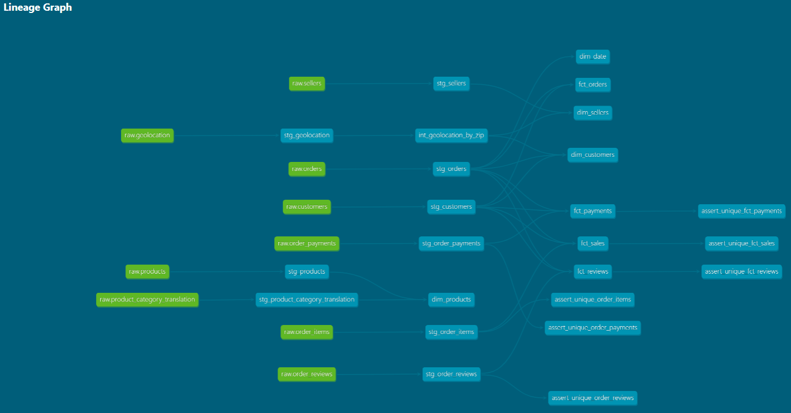
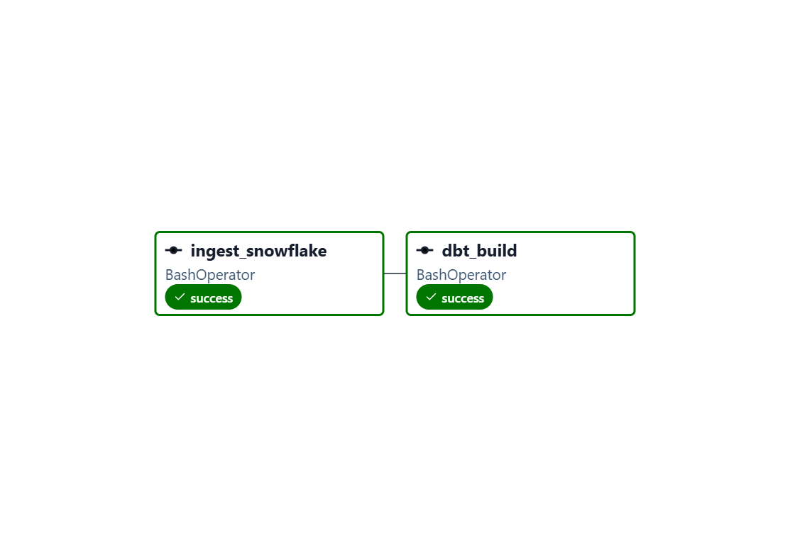
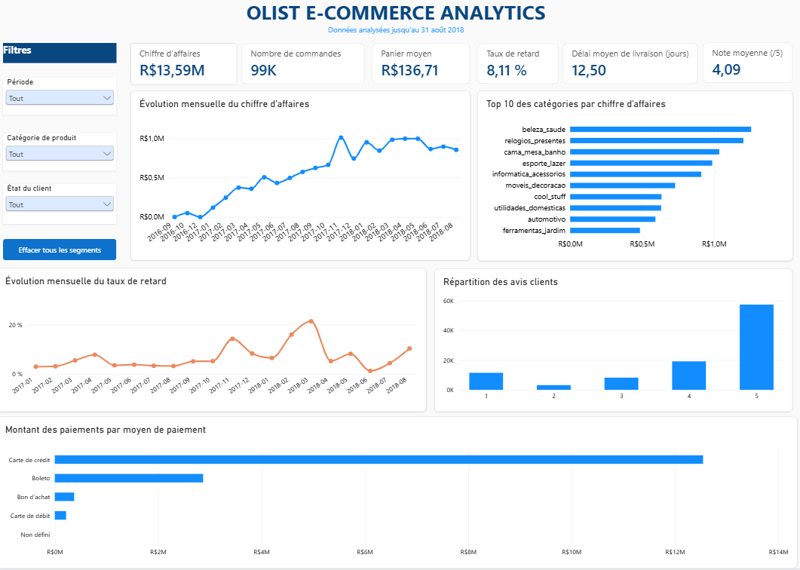

# Olist E-Commerce Analytics Pipeline

Projet Data / Analytics Engineering construit à partir du dataset public **Olist Brazilian E-Commerce**.

L'objectif est de construire un pipeline de données de bout en bout : ingestion des données brutes, stockage dans Snowflake, transformation avec dbt, orchestration avec Airflow, contrôle qualité automatisé avec GitHub Actions et restitution dans Power BI.

## Architecture

```text
Olist CSV
    |
    v
Python Ingestion
    |
    v
Snowflake
    |
    +-- RAW
    |
    v
dbt
    |
    +-- STAGING
    +-- INTERMEDIATE
    +-- MARTS
          |
          +-- Dimensions
          +-- Facts
    |
    v
Power BI

Airflow + Docker
    |
    +-- Orchestration du pipeline

GitHub Actions
    |
    +-- CI : dbt build + tests sur les Pull Requests
```

## Stack technique

| Outil | Utilisation |
|---|---|
| Python | Ingestion automatisée des fichiers CSV |
| Snowflake | Data warehouse |
| dbt | Transformation, modélisation et tests |
| Apache Airflow | Orchestration du pipeline |
| Docker | Conteneurisation de l'environnement Airflow |
| Power BI | Modélisation analytique et dashboard |
| Git / GitHub | Versioning et Pull Requests |
| GitHub Actions | Intégration continue |

## Dataset

Le projet utilise le dataset public **Olist Brazilian E-Commerce**, contenant environ 100 000 commandes réalisées sur une marketplace brésilienne.

Les données couvrent notamment :

- les clients ;
- les commandes ;
- les articles commandés ;
- les produits ;
- les vendeurs ;
- les paiements ;
- les avis clients ;
- la géolocalisation ;
- la traduction des catégories de produits.

Les fichiers CSV sources ne sont pas versionnés dans le repository.

## Ingestion des données

Un script Python automatise le chargement des fichiers sources dans la couche `RAW` de Snowflake.

Le pipeline utilise notamment :

- le connecteur Python Snowflake ;
- un stage Snowflake ;
- `INFER_SCHEMA` pour l'inférence initiale du schéma ;
- `COPY INTO` pour le chargement des données.

Les données brutes sont ensuite utilisées comme sources par dbt.

## Modélisation dbt

La transformation suit une architecture en plusieurs couches.

### STAGING

Les modèles `stg_*` nettoient et standardisent les données provenant de la couche RAW.

Exemples :

```text
stg_customers
stg_orders
stg_order_items
stg_order_payments
stg_order_reviews
stg_products
stg_sellers
stg_geolocation
stg_product_category_translation
```

### INTERMEDIATE

La couche intermédiaire contient les transformations réutilisables qui ne sont pas directement destinées à la BI.

Exemple :

```text
int_geolocation_by_zip
```

Ce modèle agrège les données géographiques afin d'obtenir une granularité unique par code postal et d'éviter les duplications lors des jointures avec les dimensions.

### MARTS

La couche MARTS contient les tables finales utilisées pour l'analyse.

**Dimensions :**

```text
dim_customers
dim_products
dim_sellers
dim_date
```

**Tables de faits :**

```text
fct_orders
fct_sales
fct_payments
fct_reviews
```

Le modèle analytique repose sur une constellation de faits partageant plusieurs dimensions communes.

## Lineage dbt

Le lineage permet de visualiser les dépendances entre les sources Snowflake, les modèles de staging, les transformations intermédiaires et les marts.



## Qualité des données

Des tests dbt sont exécutés afin de contrôler notamment :

- l'unicité des clés ;
- l'absence de valeurs nulles sur les champs structurants ;
- les relations entre modèles ;
- l'unicité des clés composites lorsque la granularité l'exige.

Le projet contient actuellement **65 tests dbt**.

La commande principale de validation est :

```bash
dbt build
```

Elle construit les modèles et exécute les tests associés.

## Orchestration avec Airflow

Apache Airflow orchestre le pipeline à travers le DAG `olist_pipeline`.

Le workflow exécute successivement :

```text
ingest_snowflake
        |
        v
dbt_build
```

La première tâche charge les données dans Snowflake. La seconde construit les modèles dbt et exécute les tests.

Airflow est exécuté dans un environnement Docker.



## Intégration continue avec GitHub Actions

Une CI a été mise en place avec **GitHub Actions**.

À chaque Pull Request vers `main`, le workflow :

```text
Pull Request
     |
     v
Checkout du repository
     |
     v
Installation de Python
     |
     v
Installation de dbt-snowflake
     |
     v
Création sécurisée du profil dbt
     |
     v
dbt build
     |
     +-- Modèles
     +-- Tests
```

Les identifiants Snowflake sont stockés dans les **GitHub Secrets** et ne sont jamais versionnés dans le repository.

Une Pull Request peut ainsi être contrôlée automatiquement avant sa fusion dans `main`.

## Dashboard Power BI

La couche MARTS de Snowflake alimente un dashboard Power BI consacré au suivi de l'activité e-commerce.

Les principaux KPI sont :

- chiffre d'affaires ;
- nombre de commandes ;
- panier moyen ;
- taux de retard ;
- délai moyen de livraison ;
- note moyenne des clients.

Le dashboard permet également d'analyser :

- l'évolution mensuelle du chiffre d'affaires ;
- les catégories de produits générant le plus de chiffre d'affaires ;
- l'évolution du taux de retard ;
- la répartition des avis clients ;
- les moyens de paiement.

Les analyses temporelles principales sont limitées au **31 août 2018** afin d'éviter la période de fin de dataset dont la couverture est incomplète.



Le fichier Power BI est disponible dans :

```text
dashboard/olist_analytics.pbix
```

## Structure du projet

```text
olist-data-pipeline/
|
+-- .github/
|   +-- workflows/
|       +-- dbt-ci.yml
|
+-- dags/
|   +-- olist_pipeline.py
|
+-- dashboard/
|   +-- olist_analytics.pbix
|
+-- docs/
|   +-- images/
|       +-- olist_pipeline-graph.png
|       +-- dbt-lineage.png
|       +-- powerbi-dashboard.png
|
+-- olist_dbt/
|   +-- models/
|       +-- staging/
|       +-- intermediate/
|       +-- marts/
|
+-- scripts/
|   +-- ingest_snowflake.py
|
+-- Dockerfile
+-- docker-compose.yml
+-- README.md
```

## Exécution du projet

### 1. Configuration Snowflake

Créer un fichier `.env` à la racine du projet avec les variables nécessaires à la connexion Snowflake.

Le fichier `.env` est exclu du versioning Git.

### 2. Lancer Airflow

Docker Desktop doit être démarré.

```bash
docker compose up -d
```

L'interface Airflow permet ensuite de déclencher le DAG `olist_pipeline`.

### 3. Exécuter dbt manuellement

Depuis le projet dbt :

```bash
cd olist_dbt
dbt build
```

### 4. Arrêter l'environnement Docker

```bash
docker compose down
```

## Sécurité

Les informations sensibles ne sont pas versionnées :

```text
.env
profiles.yml
```

La CI utilise les GitHub Secrets pour transmettre les informations de connexion à Snowflake au moment de l'exécution.

## Améliorations possibles

Le projet peut être étendu avec :

- séparation des environnements Snowflake CI / production ;
- déploiement continu après fusion dans `main` ;
- source freshness dbt ;
- rôle Snowflake dédié avec principe du moindre privilège ;
- stockage des fichiers sources dans un object storage cloud ;
- orchestration planifiée du pipeline ;
- monitoring et alerting du pipeline.